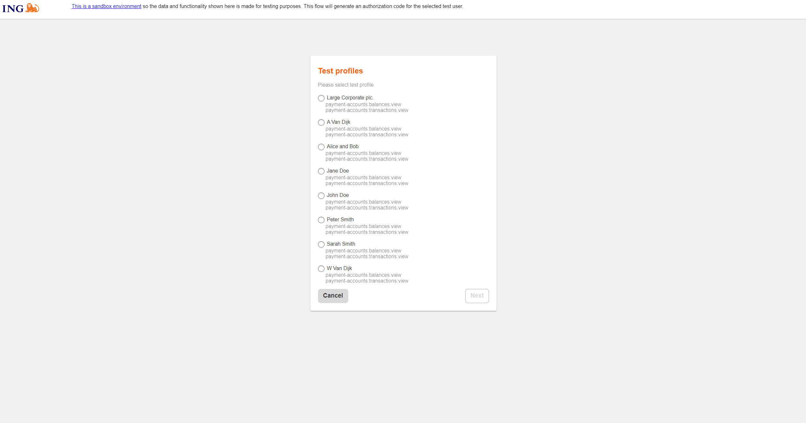

# Przetwarzanie i harmonizacja danych zgodnie z dyrektywą PSD2

## Zrobione

1. Interfejsy odpowiedzialne za komunikacje z bankami

We współpracy z wybranymi bankami utworzyłem interfejsy korzystające z dyrektywy PSD2 które odpowiadają za komunikacje z API banków

Przykładowy wybór użytkownika testowego dla jednego z wybranych banków



Po wyborze na mój server zwracane są dane na temat konta, transakcji na nim a także balansu

przykład testowego balansu

```json
{
  "account": {
    "iban": "NL69INGB0123456789",
    "maskedPan": "",
    "currency": "EUR"
  },
  "balances": [
    {
      "balanceType": "expected",
      "balanceAmount": {
        "currency": "EUR",
        "amount": 100.12
      },
      "lastChangeDateTime": "2022-07-01T09:16:54.991Z"
    }
  ]
}
```

Pozostałe dane są zbyt duże żeby je tutaj zamieszczać

Prosty server przechwytujący dane

```py
from flask import Flask, request

app = Flask(__name__)

@app.route('/get_data', methods=['GET'])
def get_data():

    code = request.args.get('code')

    if code:
        return f'{code}'
    else:
        return 'No code parameter provided in the URL'

if __name__ == '__main__':
    app.run(debug=True)

```

Dla ułatwienia dostępności jest zintegrowany z moim hostingiem na, którym będzie znajdować się baza danych dla tego projektu.

Taki interfejs został napisany na ten moment dla 3 banków, do każdego musiałem dokonać analizy zapewnionych skryptów bashowych.

Pomimo tego że nie brzmi to jakoś imponująco był to kluczowy etap tego projektu i bez niego nie byłem w stanie kontynuować.

[https://github.com/Zciwolvo/accfuse](https://github.com/Zciwolvo/accfuse)

## Do zrobienia

1. Na podstawie danych z różnych banków muszę utworzyć strukturę bazy danych znajdując złoty środek.
2. Zaprojektować front
3. Napisać front i moduł autoryzacji dla projektu
4. Zaprojektować możliwe analizy finansowe dostępne dla użytkowników projektu
